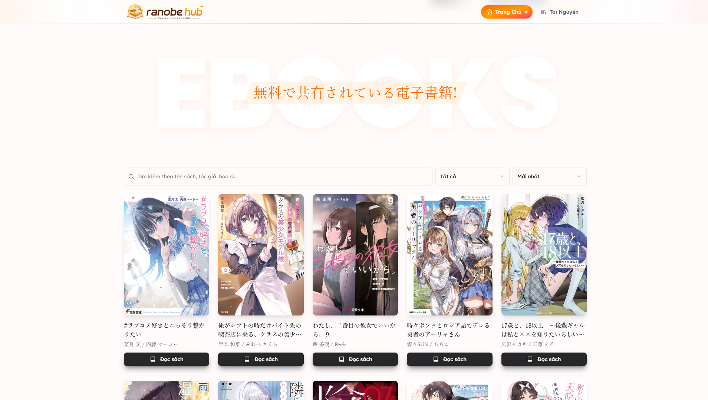
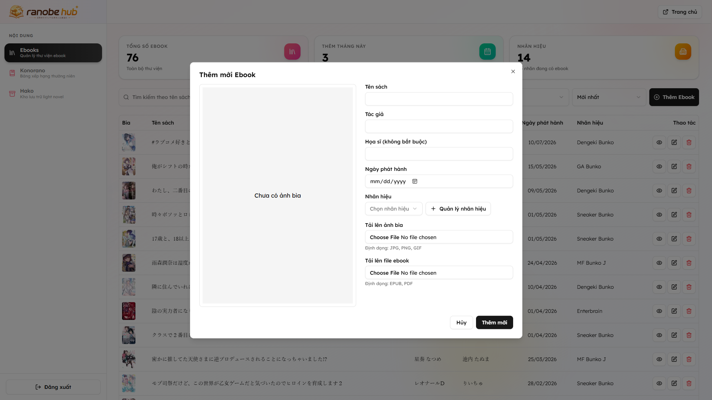
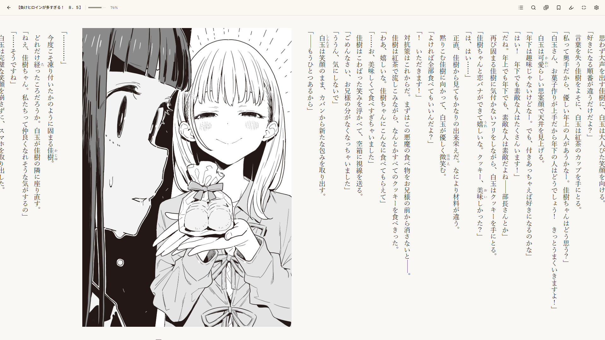

    

<h2 align="center"> Ranobe Hub </h2>

<h4 align="center"> Central place to share light novel with the people who ask to read them from me. </h4>

    
    

### About

I kept getting asked to share light novels with people, and passing files around one by one got tiring. So I built Ranobe Hub — a single, tidy place where anyone who wants to read the novels I have can browse the collection and read them right in the browser.

Reading is powered by [**Aozora**](https://github.com/meokisama/aozora), an EPUB reader built for Japanese light novels. Ranobe Hub embeds its web port so every book opens straight in the browser.

### Screenshots

